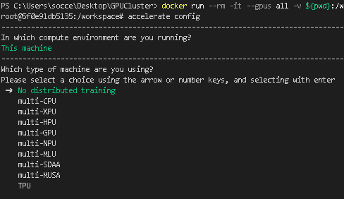

# 概要

## ミニチュア環境でベンチマークのプロセスを学ぶ

MLPerf Trainingは、大規模な計算資源を対象としているタスクが多く、検証環境などではリソースが足りない。

そこで、指定された環境でベンチマークの指標を出すのではなく、
ミニチュア環境を作り、ベンチマークのプロセス自体を学ぶ。

具体的には、

- Environment
  - NVIDIA GPU Cloudで提供されているDockerイメージを基盤とする
  - GPU/CPU設定や依存関係などについて、再現性のある実行環境を用意する
- Dataset: 
  - databricks-dolly-15kを利用する
  - instruction tuning用のオープンデータセット
- Model:
  - Llama 3.2 1Bを利用する
  - pretraining済みモデルをロードし、dolly-15kでファインチューニング
- Metrics:
  - Cross-Entropy-Loss: MLPerfのQuality Targetに倣う
  - Perplexity: モデルが平均して何択問題を解いているか直感的に解釈するための指標
  - Time-to-Train: 目標精度に到達するまでの学習時間 

として、ベンチマークのプロセスを学ぶ。

-----


# 1. 環境構築

```pytorch/pytorch:2.2.0-cuda11.8-cudnn8-runtime```をベースにして、イメージ作成。

```sh
docker build -t lora-finetuning-benchmark:latest .
```

sanity_checkを実行し、GPUが認識されて使用可能な状態かどうかを確認する。

```sh
# windows
docker run --rm --gpus all -v ${PWD}:/workspace -w /workspace lora-finetuning-benchmark:latest python sanity_check.py

# linux
docker run --rm --gpus all -v $(pwd):/workspace -w /workspace lora-finetuning-benchmark:latest python sanity_check.py
```

GPUが認識されていて、問題なく処理を行えている場合、以下のような出力となる。

```sh
=== SANITY CHECK ===
Python: 3.10.13 (main, Sep 11 2023, 13:44:35) [GCC 11.2.0]
Torch version: 2.2.0
CUDA available: True
CUDA device count: 1
 - Device 0: NVIDIA GeForce RTX 3060 Ti
Matrix multiply (1024x1024) took 0.0880 sec on GPU
Tiny model forward produced shape: torch.Size([2, 10])
=== END ===
```

-----

# 2. データセットのダウンロードと前処理

ここでは、[meta-llama/Llama-3.2-1B](https://huggingface.co/meta-llama/Llama-3.2-1B)を利用する。
meta-llama/Llama-3.2-*は、[このリポジトリ](https://huggingface.co/collections/meta-llama/metas-llama-32-language-models-and-evals-675bfd70e574a62dd0e40586)に対する利用申請が必要。

利用申請が通ったら、HuggingFace上から、```Profile->Access Token->Create new token```で新しいトークンを作る。
このとき、```Read```というタブに移動し、読み取り権限で作成する。

環境変数HF_TOKENにトークンを設定し、docker runする時にコンテナ内の環境変数として渡す。
ソースコード側で環境変数```HUGGINGFACE_HUB_TOKEN```を見に行くようにすることで、
作成したトークンが参照され、自身がHuggingFace上でアクセス可能なモデルにソースコード上からアクセスできる。

```py
token = os.environ.get("HUGGINGFACE_HUB_TOKEN")
tokenizer = AutoTokenizer.from_pretrained(
    args.model_name, use_fast=True, token=token
)
```

まずは、データセットのダウンロードとデータのチェックを行う。

```sh
# windows
$env:HF_TOKEN="hf_xxx"

docker run --rm --gpus all -e HUGGINGFACE_HUB_TOKEN=$env:HF_TOKEN -v /D:/ssd -v ${PWD}:/workspace -w /workspace lora-finetuning-benchmark:latest python scripts/download_and_check_dolly.py --output_dir /ssd/dolly15k/raw
```

以下のような出力が得られれば、データセットのダウンロードとチェックは完了。
全データ数は15011件で、各データは以下のように構成されていることがわかる。

- instruction 
    - ユーザが入力する質問文
    - 欠損値はなし
- context
    - instructionの補足文
    - 10000件ほどが欠損値であり、ない場合が多い
- response
    - AIが回答すべき文章の見本
    - 欠損値はなし
- category
    - どのようなタスクかを分類した値
    - 欠損値はなし

```sh
=== Downloading databricks-dolly-15k ===
Generating train split: 100%|██████████| 15011/15011 [00:00<00:00, 150583.69 examples/s]
Saving the dataset (0/1 shards):   0%|          | 0/15011 [00:00<?, ? examples/s]=== Dataset Info ===
DatasetDict({
    train: Dataset({
        features: ['instruction', 'context', 'response', 'category'],
        num_rows: 15011
    })
})
=== Null Value Check ===
instruction: 0 null/empty
context: 10544 null/empty
response: 0 null/empty
category: 0 null/empty
=== Sample Data ===
[0] instruction: When did Virgin Australia start operating?
    context: Virgin Australia, the trading name of Virgin Australia Airlines Pty Ltd, is an Australian-based airline. It is the largest airline by fleet size to use the Virgin brand. It commenced services on 31 August 2000 as Virgin Blue, with two aircraft on a single route. It suddenly found itself as a major airline in Australia's domestic market after the collapse of Ansett Australia in September 2001. The airline has since grown to directly serve 32 cities in Australia, from hubs in Brisbane, Melbourne and Sydney.
    response: Virgin Australia commenced services on 31 August 2000 as Virgin Blue, with two aircraft on a single route.
--------------------------------------------------
[1] instruction: Which is a species of fish? Tope or Rope
    context:
    response: Tope
--------------------------------------------------
[2] instruction: Why can camels survive for long without water?
    context:
    response: Camels use the fat in their humps to keep them filled with energy and hydration for long periods of time.
--------------------------------------------------
=== Saving raw dataset ===
Saving the dataset (1/1 shards): 100%|██████████| 15011/15011 [00:00<00:00, 67129.72 examples/s]
Done. Saved at /ssd/dolly15k/raw
```


代替として、完全オープンな[EleutherAI/gpt-neo-1.3B](https://huggingface.co/EleutherAI/gpt-neo-1.3B)を利用し、申請が通ったらLlamaに置き変えてもいい。


※linuxの場合は、$(pwd)とする。

```sh
# gpt-neo-1.3B
docker run --rm --gpus all -e HUGGINGFACE_HUB_TOKEN=$env:HF_TOKEN -v /D:/ssd -v ${PWD}:/workspace -w /workspace lora-finetuning-benchmark:latest python scripts/preprocess_dolly.py --model_name EleutherAI/gpt-neo-1.3B --output_dir /ssd/dolly15k/processed
```

-------

# 3. データの前処理

ダウンロードしたデータに対して前処理を行う。
今回、オープンデータセットであり欠損値を埋めるなどの対応は不要となっている。

ここでは、主に以下のような前処理を行う。
- train用とtest用にデータセットを分割する
- 学習時には文字ではなく数値となっていてほしいので、文字列をトークン化する
- ```instruction+context```を入力として、```response```が出力となるような組を作る
- AIに学習してほしいのは、```response```部分のため、入力部分で損失が計算されないようにする

処理を実行する。

```sh
docker run --rm --gpus all -e HUGGINGFACE_HUB_TOKEN=$env:HF_TOKEN -v /D:/ssd -v ${PWD}:/workspace -w /workspace lora-finetuning-benchmark:latest python scripts/preprocess_dolly.py --model_name meta-llama/Llama-3.2-1B --input_dir /ssd/dolly15k/raw --output_dir /ssd/dolly15k/processed
```

以下のような出力が得られれば、前処理済みのデータが指定フォルダに保存されている。

```sh
=== Loading raw dataset ===
=== Splitting train/test ===
=== Tokenizing ===
Map: 100%|██████████| 13509/13509 [00:09<00:00, 1419.80 examples/s]
Map: 100%|██████████| 1502/1502 [00:01<00:00, 1345.96 examples/s]
Saving the dataset (0/1 shards):   0%|          | 0/13509 [00:00<?, ? examples/s]=== Saving to disk ===
Saving the dataset (1/1 shards): 100%|██████████| 13509/13509 [00:00<00:00, 23586.08 examples/s]
Saving the dataset (1/1 shards): 100%|██████████| 1502/1502 [00:00<00:00, 18122.06 examples/s]
Done. Saved at /ssd/dolly15k/processed
```


-------

# 3. データの前処理確認

作成したデータが期待通りになっているかチェックする。

```sh
docker run --rm --gpus all -e HUGGINGFACE_HUB_TOKEN=$env:HF_TOKEN -v /D:/ssd -v ${PWD}:/workspace -w /workspace lora-finetuning-benchmark:latest python scripts/check_dataset.py
```

以下のような出力が得られれば、チェック完了。

```sh
=== Dataset loaded ===
Dataset({
    features: ['input_ids', 'attention_mask', 'labels'],
    num_rows: 13509
})

=== Third train example (tokenized) ===
Input IDs: [128000, 70620, 13, 1268, 1690, 37465, 1051, 37191, 304, 4435, 5111, 220, 17, 5380, 7816, 1109, 220, 1041, 11, 931, 37465, 1051, 37191, 311, 279, 3816, 11511, 2391, 29144, 17]
Labels   : [-100, -100, -100, -100, -100, -100, -100, -100, -100, -100, -100, -100, -100, -100, 7816, 1109, 220, 1041, 11, 931, 37465, 1051, 37191, 311, 279, 3816, 11511, 2391, 29144, 17]
Attention mask: [1, 1, 1, 1, 1, 1, 1, 1, 1, 1, 1, 1, 1, 1, 1, 1, 1, 1, 1, 1, 1, 1, 1, 1, 1, 1, 1, 1, 1, 1]
Masked count (-100): 14 / 30
Active tokens (sum of attention_mask): 30
Sequence length (len): 30

Decoded text:
 <|begin_of_text|>Approx. how many nurses were enrolled in World War 2?
More than 100,000 nurses were enrolled to the Red Cross during WW2
```

# 4. Accelerateの初期設定

ホスト側にaccelerateのconfigをマウントして永続化するためのディレクトリを作成する(初回のみ実行)

```sh
# Windows (PowerShell)
mkdir ${HOME}/.cache

# Linux / macOS
mkdir -p ~/.cache
```

対話モードでコンテナを起動

```sh
docker run --rm -it --gpus all -v ${pwd}:/workspace -v ${HOME}/.cache:/root/.cache -w /workspace lora-finetuning-benchmark:latest
```

accelerate configを実行し、以下のように対話形式でconfigファイルを作成する。

```sh
accelerate config

------------------------------
In which compute environment are you running?
This machine
------------------------------
Which type of machine are you using?
No distributed training
Do you want to run your training on CPU only (even if a GPU / Apple Silicon / Ascend NPU device is available)? [yes/NO]:NO                                              
Do you wish to optimize your script with torch dynamo?[yes/NO]:NO                                                                                                       
Do you want to use DeepSpeed? [yes/NO]: NO                                                                                                                              
What GPU(s) (by id) should be used for training on this machine as a comma-separated list? [all]:all                                                                    
Would you like to enable numa efficiency? (Currently only supported on NVIDIA hardware). [yes/NO]: NO                                                                   
-----------------------------
Do you wish to use mixed precision?                                                                                                                                     
bf16

accelerate configuration saved at /root/.cache/huggingface/accelerate/default_config.yaml
```

※ 本番環境などでは、multi-GPU等を選択することで、学習用などのコードを変更することなく、インフラの変更に対応できる。


-----

# 5. 学習プロセスのスモークテストを実施

```sh
docker run --rm --gpus all -e HUGGINGFACE_HUB_TOKEN=$env:HF_TOKEN -v ${pwd}:/workspace -v ${HOME}/.cache:/root/.cache -v /D:/ssd -w /workspace lora-finetuning-benchmark:latest accelerate launch scripts/train.py --dataset_dir="/ssd/dolly15k/processed" --max_train_steps=16
```